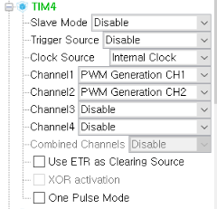
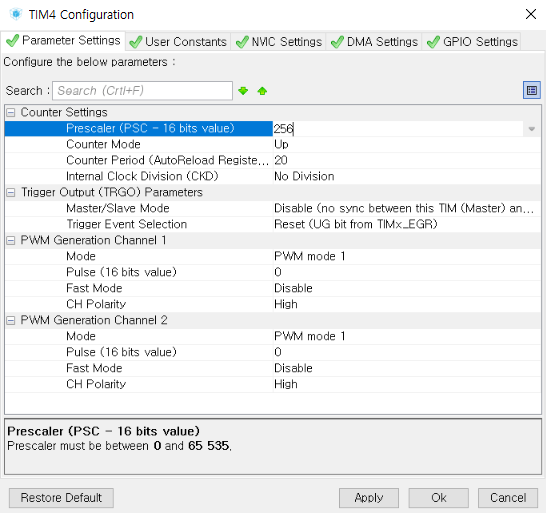

# PWM 제어

`TIM4`를 이용해 PWM 제어를 진행해보자.

`TIM4`는 총 채널 4개를 가지고 있다.
`TIM_CHANNEL_1`, `TIM_CHANNEL_2`, `TIM_CHANNEL_3`, `TIM_CHANNEL_4`

이들은 순서대로 `PD12`, `PD13`, `PD14`, `PD15` 에 할당되어 있다.

타이머마다 가지고 있는 채널의 수가 다른데, 이는 STM32CubeMX에서 바로 확인할 수 있다.

먼저 PWM을 사용하기 위해서, 핀 설정을 진행하자. `TIM4` 핀을 클릭하여, Clock Source를 `Internal Clock` 으로 바꿔 주고, Channel1과 Channel2를 `PWM Generation CHx` 로 설정해주자.



이 설정의 결과로 인해, `TIM4`의 채널 `TIM_CHANNEL_1`과 `TIM_CHANNEL_2` 를 사용할 수 있게 되었다.

이제 상단의 `Configuration` 탭에서, `TIM4`의 레지스터 설정을 진행하자.



여기서는 Prescaler를 256, 주기를 20으로 설정하였다.

이제 `Genarate Code`를 실행하여 코드로 넘어가자. 먼저 `main` 함수의 초기화 과정에서, 타이머 또한 초기화를 수행해야 한다.
```
MX_TIM4_Init();
HAL_TIM_PWM_Start(&htim4, TIM_CHANNEL_1);
HAL_TIM_PWM_Start(&htim4, TIM_CHANNEL_2);
```
이를 통해 `TIM4`의 1번 채널과 2번 채널을 PWM Generator로 사용할 수 있게 되었다.

PWM의 실제 사용은 간단하다.

```
int power = 0;

for(power=0;power<20;power++){
    TIM4->CCR1 = power;
    TIM4->CCR2 = (int)power/2;
    HAL_Delay(50);
}

for(power=20;power>0;power--){
    TIM4->CCR1 = power;
    TIM4->CCR2 = (int)power/2;
    HAL_Delay(50);
}
```

`CCRx` 로 `x`번 채널을 설정하여, 초기 설정에 맞게 PWM 신호를 생성해 낼 수 있다. 위의 코드는 1초 간격으로 점멸을 반복하며 LED의 Dimming 제어를 보여주는 예제 코드이다.
