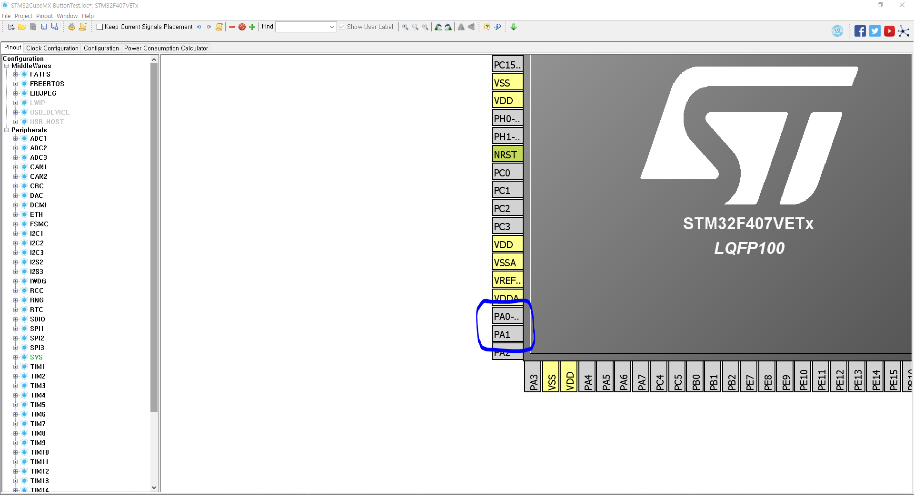
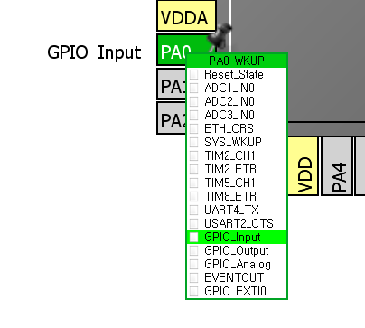
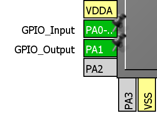
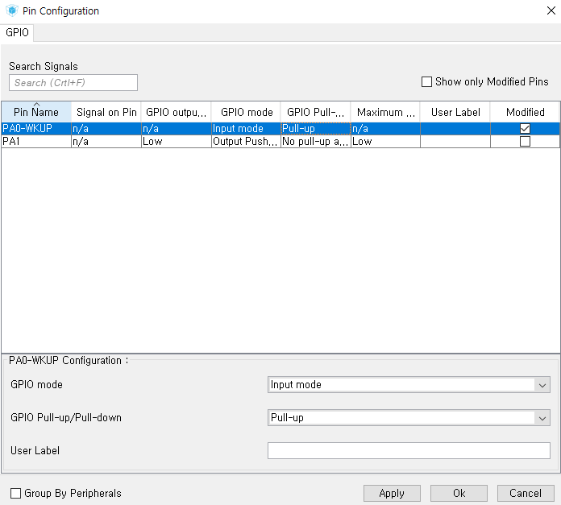

# Button 입력

푸시 버튼 입력 구현을 통해, GPIO로 값을 Input 받는 법을 알아보자.

`PA0`을 푸시 버튼의 입력, `PA1`을 LED의 출력으로 쓰자.



Input과 Output을 설정해주자.





그 후, Configuration 탭의 GPIO 설정에서, `PA0` 핀에 내부 풀업 저항을 설정해주자.



IAR에서의 입력 처리는 `HAL_GPIO_ReadPin` 함수를 이용하여 처리할 수 있다.

```
if(HAL_GPIO_ReadPin(GPIOA, GPIO_PIN_0) == 0){
      Pinstat = !Pinstat;
      HAL_Delay(200);
    }
    HAL_GPIO_WritePin(GPIOA, GPIO_PIN_1, Pinstat);
```
